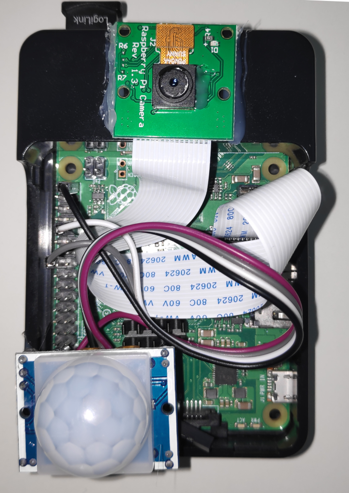

## Face recognition cam with raspberry pi

This project is based on [face_detection_picamera](https://github.com/navneet-parab/face_detection_picamera).

The goal of this project is to build a low power face recognition cam using a Raspberry Pi.  
Only if the pir sensor detects motion the face recognition algorithm is executed.
Faces are assigned names and via Mqtt the information 'motion detected', 'face recognized (with name)' or 'face not recognized' are reported to a home automation system.
For better privacy protection video streaming over the network is not used.
I personally use openHAB to process the data, but any system with a Mqtt bridge can be used.

### Software Installation
For opencv the opencv-python-headless version is used, it comes without UI bindings and uses less resources.
Use pip to install all required packages.  
Setup the Mqtt server in script *face_req.py*

### Model Training
Add your images under dataset/\<name>/\<image>.
run the script *train_model.py* to create the *encodings.pickle* file with all your training data.

### Face recognition
When training is finished run the script *facial.py*.

### RP3 B+ with PI Cam and PIR Sensor 287-18001

### Usage example
In my personal setup openHAB executes the following rules:  
If a person is not recognized, the person is asked to face the camera (for audio I use a Google Nest).
If the person does not comply or is unknown to the system, an alarm is triggered.
If a face is recognized the system marks this person as present. 
If no motion is detected for some time the person is marked as absent.
